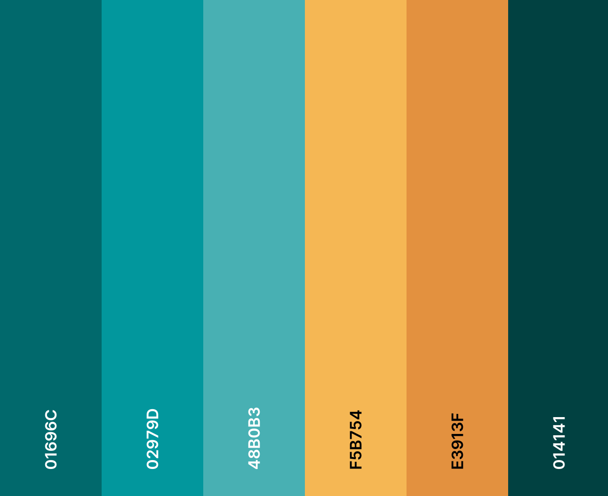

# Logo Files for Cyclone RoboSub @ UC Davis
Hey there! This repository contains everything you need for the official Cyclone RoboSub branding. 

Please read the information below to get started. If you have any questions, don't be afraid to reach out!

---

# Navigation

The branding assets are organized into the following directories:

- [**`1 - Logo Renders`**](1%20-%20Logo%20Renders/): Renders of the standalone propeller icon in various colorways, sizes, and formats, along with the master vector source ([`Cyclone_Logo.svg`](1%20-%20Logo%20Renders/Cyclone_Logo.svg)).
- [**`2 - Title Card Renders`**](2%20-%20Title%20Card%20Renders/): Renders of the full team title card ("Cyclone RoboSub") in various colorways and sizes, along with the master vector source ([`Cyclone_Title.svg`](2%20-%20Title%20Card%20Renders/Cyclone_Title.svg)).
- [**`3 - Fonts`**](3%20-%20Fonts/): Official typography used across team branding (Righteous Regular).
- [**`4 - QR Codes`**](4%20-%20QR%20Codes/): Official QR codes for team registration, social channels, and links.
- [**`5 - Video Thumbnails`**](5%20-%20Video%20Thumbnails/): Thumbnail graphics and vector assets for Give Day, crowdfunding, and video releases.
- [**`6 - Report Format`**](6%20-%20Report%20Format/): Official Typst report templates, styling, and documentation formats.

---

# Naming Convention

All logo and title card files follow a structured naming pattern:

```
Cyclone_{Type}_{Foreground}-on-{Background}_{Size}.{ext}
```

### Components

| Component | Description | Values |
| :--- | :--- | :--- |
| **Prefix** | Project / team identifier | `Cyclone` |
| **Type** | Graphic type | `Logo` (Propeller icon mark), `Title` (Full team title card) |
| **Colorway** | Foreground and background color setup | `Color-on-Clear`, `Color-on-Dark`, `Color-on-White`, `White-on-Clear`, `Black-on-White`, `Color-on-White-Circle` |
| **Size** | Asset resolution / application scale | `Large`, `Medium`, `Small`, `Desktop` |

### Colorway Details
- **`Color-on-Clear`**: Official team colors on a transparent (clear) background. Ideal for light backgrounds and general web/print use.
- **`Color-on-Dark`**: Adapted color palette (using white and light cyan) on a transparent (clear) background. Designed specifically for optimal contrast on dark backgrounds and dark mode interfaces.
- **`White-on-Clear`**: Monochrome white graphic on a transparent (clear) background.
- **`Black-on-White`**: Monochrome black graphic on an opaque white background.
- **`Color-on-White`**: Full color branding on an opaque white background.
- **`Color-on-White-Circle`**: Full color logo inside a circular white cutout badge with transparent corners.

### Size Reference
- **`Large`**: High-resolution master raster render (1024×1024 for Logo, 2048×1024 for Title).
- **`Medium`**: Standard resolution render (512×512 for Logo, 1024×512 for Title).
- **`Small`**: Compact icon render (128×128 for Logo).
- **`Desktop`**: 16:9 4K widescreen format (3840×2160 for Title).

---

# Instructions for Use

This branding has been designed with several use cases in mind. Please consult the sections below to help determine which file you should use.

## Logo Type Selection

Generally, title cards are ideal for displaying the Cyclone logo in prominent spaces such as headers or banners, where additional context or space is available compared to icon-only use.

### Icon Examples (`Logo`)
- Social media profile pictures (without cropping)
- Website favicons and application icons
- Corner placement on Cyclone-branded materials and slide decks
- Badges, small stickers, and apparel marks

### Title Card Examples (`Title`)
- Website headers and navigation bars
- Document headers, report covers, and letterheads
- Posters, banners, and sponsorship displays
- Video title screens and presentation title slides

## Color Selection

The color and background style of a particular file can be determined by looking at the file name. For example, a file labeled `..._White-on-Clear_...` will feature white graphics on a transparent (clear) background.

### Graphic Color
- **Primary Brand Color (`Color-...`)**: Whenever possible, use the **full color version** of the logo or title card. This represents the **primary brand identity** of Cyclone RoboSub and should be prioritized.
- **Black (`Black-...`)**: The black version should be used on printouts with lightly colored backgrounds (including white) and in conjunction with black text or monochrome printing.
- **White / Dark-Mode (`White-...` / `Color-on-Dark`)**: Use white or dark-adapted versions in cases where the colors of the primary logo do not provide sufficient contrast, such as against dark backgrounds or dark mode interfaces.

### Background Color & Framing
- **Clear Backgrounds (`-on-Clear` / `-on-Dark`)**: In all standard design applications, use the logo with a clear (transparent) background to integrate smoothly with your underlying page or background design.
- **Social Media Profile Pictures**: If you are using the logo for a profile picture, consider using the `Color-on-White-Circle` or `Color-on-Dark` files to ensure clear visibility and framing across apps in both light and dark modes.
- **Solid White Backgrounds (`-on-White`)**: Use solid white background files when embedding into platforms or software that do not properly handle transparency.

## Size Selection

Whenever possible, try to use the image with the largest resolution available (`Large`). This will reduce the chances of the logo appearing pixelated or blurry.

If you are uploading the logo to a website or service, they will often specify the ideal dimensions:
- **`Large`** (1024×1024 for Logo, 2048×1024 for Title): High-resolution displays, print media, banners, and video exports.
- **`Medium`** (512×512 for Logo, 1024×512 for Title): Standard web graphics and avatar uploads. For example, the ideal size for a Discord Server Icon is 512×512px, which directly aligns with the `Medium` sized logo.
- **`Small`** (128×128 for Logo): Compact icons, thumbnails, and inline badges.
- **`Desktop`** (3840×2160 for Title): 16:9 4K widescreen wallpapers, presentation backdrops, and video title cards.

---

# Asset Directory

### `1 - Logo Renders` (Propeller Mark)

| File Name | Resolution | Description |
| :--- | :--- | :--- |
| [`Cyclone_Logo_Color-on-Clear_Large.png`](1%20-%20Logo%20Renders/Cyclone_Logo_Color-on-Clear_Large.png) | 1024×1024 | Full color on transparent background |
| [`Cyclone_Logo_Color-on-Dark_Large.png`](1%20-%20Logo%20Renders/Cyclone_Logo_Color-on-Dark_Large.png) | 1024×1024 | Adjusted color on transparent background (for dark backgrounds) |
| [`Cyclone_Logo_Color-on-White_Medium.png`](1%20-%20Logo%20Renders/Cyclone_Logo_Color-on-White_Medium.png) | 512×512 | Full color on solid white background |
| [`Cyclone_Logo_Color-on-White_Small.png`](1%20-%20Logo%20Renders/Cyclone_Logo_Color-on-White_Small.png) | 128×128 | Full color on solid white background |
| [`Cyclone_Logo_Color-on-White-Circle_Medium.png`](1%20-%20Logo%20Renders/Cyclone_Logo_Color-on-White-Circle_Medium.png) | 512×512 | Full color on circular white cutout badge |
| [`Cyclone_Logo_Color-on-White-Circle.svg`](1%20-%20Logo%20Renders/Cyclone_Logo_Color-on-White-Circle.svg) | Vector | Circle cutout badge vector |
| [`Cyclone_Logo_White-on-Clear_Medium.png`](1%20-%20Logo%20Renders/Cyclone_Logo_White-on-Clear_Medium.png) | 512×512 | Monochrome white on transparent background |
| [`Cyclone_Logo_Black-on-White_Medium.png`](1%20-%20Logo%20Renders/Cyclone_Logo_Black-on-White_Medium.png) | 512×512 | Monochrome black on solid white background |
| [`Cyclone_Logo.svg`](1%20-%20Logo%20Renders/Cyclone_Logo.svg) | Vector | Master Inkscape vector source |

### `2 - Title Card Renders` (Full Team Title)

| File Name | Resolution | Description |
| :--- | :--- | :--- |
| [`Cyclone_Title_Color-on-Clear_Large.png`](2%20-%20Title%20Card%20Renders/Cyclone_Title_Color-on-Clear_Large.png) | 2048×1024 | Full color on transparent background |
| [`Cyclone_Title_Color-on-Clear_Medium.png`](2%20-%20Title%20Card%20Renders/Cyclone_Title_Color-on-Clear_Medium.png) | 1024×512 | Full color on transparent background |
| [`Cyclone_Title_Color-on-Dark_Medium.png`](2%20-%20Title%20Card%20Renders/Cyclone_Title_Color-on-Dark_Medium.png) | 1024×512 | Adjusted color/white on transparent background (for dark backgrounds) |
| [`Cyclone_Title_Color-on-White_Large.png`](2%20-%20Title%20Card%20Renders/Cyclone_Title_Color-on-White_Large.png) | 2048×1024 | Full color on solid white background |
| [`Cyclone_Title_Color-on-White_Medium.png`](2%20-%20Title%20Card%20Renders/Cyclone_Title_Color-on-White_Medium.png) | 1024×512 | Full color on solid white background |
| [`Cyclone_Title_Color-on-White_Desktop.png`](2%20-%20Title%20Card%20Renders/Cyclone_Title_Color-on-White_Desktop.png) | 3840×2160 | 4K 16:9 desktop format on solid white background |
| [`Cyclone_Title_Black-on-White_Large.png`](2%20-%20Title%20Card%20Renders/Cyclone_Title_Black-on-White_Large.png) | 2048×1024 | Monochrome black on solid white background |
| [`Cyclone_Title_Newsletter_Color-on-White_Large.png`](2%20-%20Title%20Card%20Renders/Cyclone_Title_Newsletter_Color-on-White_Large.png) | 2048×1024 | Newsletter edition title card on solid white background |
| [`Cyclone_Title.svg`](2%20-%20Title%20Card%20Renders/Cyclone_Title.svg) | Vector | Master Inkscape vector source |

---

# Team Color Palette



| Color Swatch | Hex Code | Primary Usage |
| :--- | :--- | :--- |
| **Deep Teal** | `#01696C` | Primary brand color, logo blades, typography |
| **Ocean Teal** | `#02979D` | Secondary brand color, highlights |
| **Light Teal** | `#48B0B3` | Propeller inner accents, dark mode contrast elements |
| **Gold** | `#F5B754` | Accent color |
| **Orange** | `#E3913F` | Accent color |
| **Pine / Dark Teal** | `#014141` | Dark background accent |

---

# Customization

If none of the pre-rendered files meet your needs or you would like to generate custom dimensions or colorways, please feel free to use the included `.svg` vector files:
- [`1 - Logo Renders/Cyclone_Logo.svg`](1%20-%20Logo%20Renders/Cyclone_Logo.svg)
- [`2 - Title Card Renders/Cyclone_Title.svg`](2%20-%20Title%20Card%20Renders/Cyclone_Title.svg)

Using these files, you can edit geometries, adjust layers, and export high-resolution assets at any size.

### Opening `.svg` Files
All vector files were created using [Inkscape](https://inkscape.org/). We recommend opening them with Inkscape to maintain complete layer hierarchy and metadata. 
